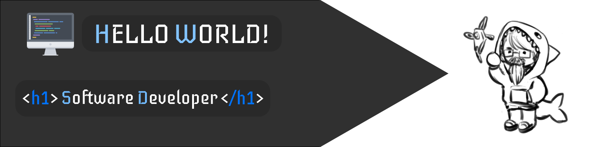

 

<h1 align="center">💻 <b>Hey there!</b></h1>

- 🎓 Front-end development
- 🔒 Privacy advocate
- 🎮 Free time? Reading/listening to tech-related content & playing video games

    &emsp;
       

     

---

    <h3><b>Leveling Up On</b></h3>

- React (Next)
- [Astro](https://astro.build/)
- Typescript

---

<h3 align="center">💬 Let's connect! 👍</h3>
